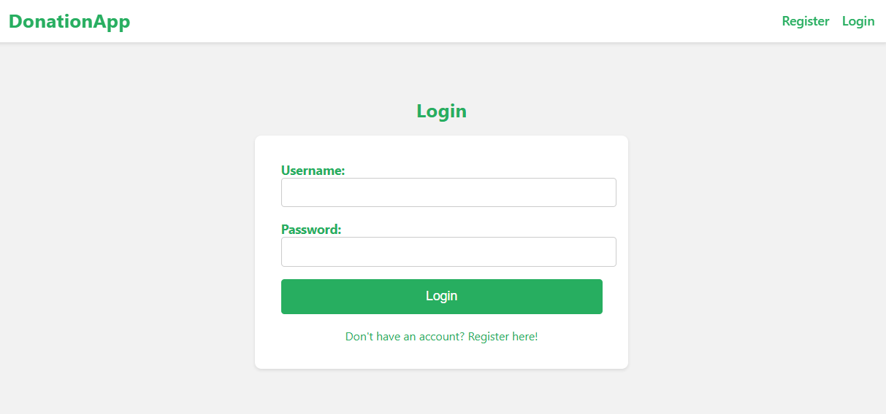

# FYP
 
## Install packages before run:

Open a terminal and navigate to project directory

```
cd donation_app
```

../donation_app>
```
pip install -r requirements.txt
```

Also, for frontend, open another terminal and navigate to the frontend directory

```
cd donation_app
```
```
cd donations-frontend
```

../donation_app/donations-frontend>
```
npm install
```


## Sample accounts in the database:

Some accounts have been created beforehand for testing purposes

<details>
  <summary>Staff accounts: (Click to View)</summary>
  <ol>
    <li> admin (superuser)
      <ul>
        <li>Username: admin</li>
        <li>Password: abcd@1234</li>
      </ul>
    </li>
    <li> Moderator1
      <ul>
        <li>Username: moderator1</li>
        <li>Password: abcd@1234</li>
      </ul>
    </li>
    <li> Moderator2
      <ul>
        <li>Username: Moderator2</li>
        <li>Password: abcd@1234</li>
      </ul>
    </li>
    <li> Volunteer1
      <ul>
        <li>Username: volunteer1</li>
        <li>Password: abcd@1234</li>
      </ul>
    </li>
    <li> Volunteer2
      <ul>
        <li>Username: volunteer2</li>
        <li>Password: abcd@1234</li>
      </ul>
    </li>
  </ol>
</details>
<br>
<details>
  <summary>Normal accounts: (Click to View)</summary>
  <ol>
    <li> Donor1
      <ul>
        <li>Username: donor1</li>
        <li>Password: abcd@1234</li>
      </ul>
    </li>
    <li> Donor2
      <ul>
        <li>Username: donor2</li>
        <li>Password: abcd@1234</li>
      </ul>
    </li>
  </ol>
</details>

## Running the application

To run the backend tests, make sure you are in the project directory

```
py manage.py test
```

To start the Django backend server, make sure you are in the project directory

```
py manage.py runserver
```

To start the React development server, make sure you are in the frontend directory

```
npm start
```

## Upon starting the application successfully, you will see this landing page
